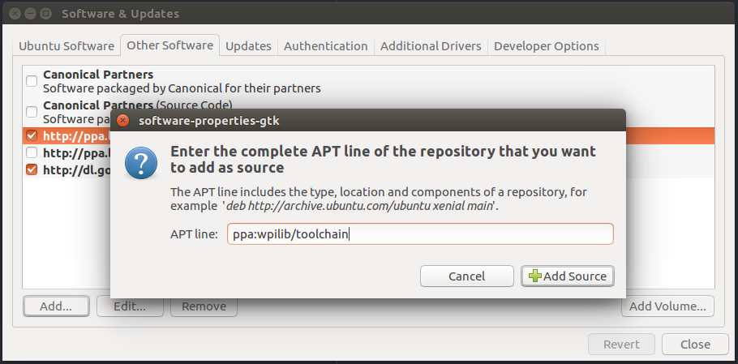
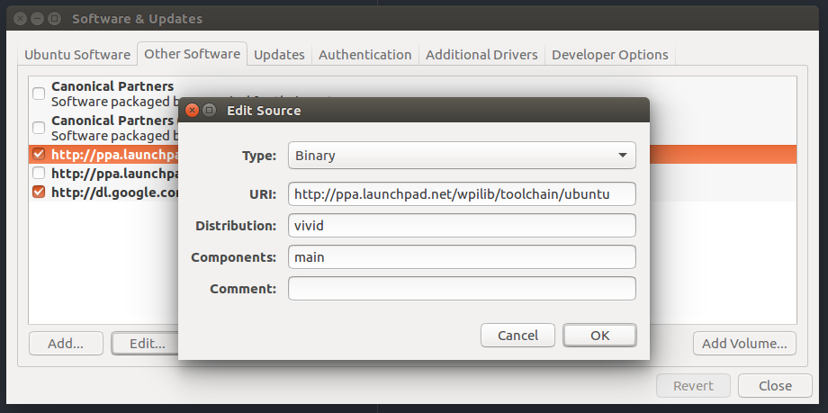

# FRC Toolchain Installation Instructions

This provides instructions on installing the most recent version of the FRC Toolchain on our standard developer workstations.

## Install on Xenial from Vivid PPA

Manually add the [vivid PPA](https://launchpad.net/~wpilib/+archive/ubuntu/toolchain/), as suggested by this [post](https://www.chiefdelphi.com/forums/showthread.php?p=1597353). Skip the package update when prompted.



Change the desired PPA relase from xenial to vivid as show below.



The vivid version of the toolchain depends on a older version of libisl as discussed [here](https://www.chiefdelphi.com/forums/showthread.php?t=141395). The link to the libisl dep can be found [here](https://launchpad.net/ubuntu/vivid/+package/libisl13), download the amd64 version and install.

At the command line run:

```
sudo apt update
sudo apt install frc-toolchain
```
